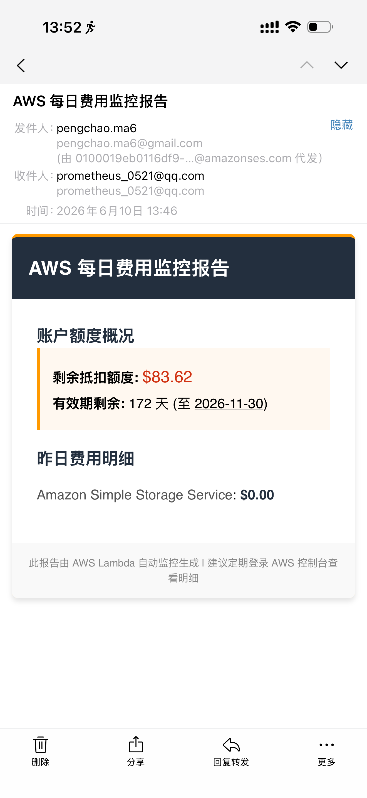

# aws-lambda-ses-send-billings
In this demo, I will use terraform to deploy lambda and ses to send billing details everyday at 13:00PM
both lambda and ses using modules
also intergrated github actions workflow deploy.yaml to do aoto-deploy after PR merged

lambda function using python 

## Display like this

